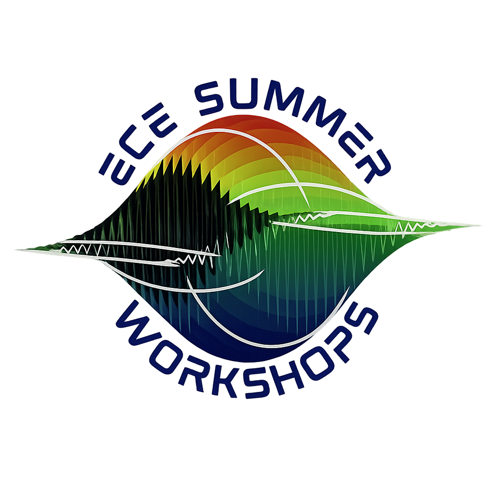

<h1 align="center">🤖 ECE Workshops 🔌</h1>

<p align="center">
  Website for UofT's summer ECE Workshops, a free two-week program where ECE first-years learn analog and digital electronics, embedded systems, and robotics through hands-on projects. Started as a Canva sketch.
  <br />
  <br />
  <a href="https://github.com/AndyDerevyanko/ECE-Summer-Workshop-Website/issues">Report Bug</a>
  ·
  <a href="https://github.com/AndyDerevyanko/ECE-Summer-Workshop-Website/issues">Request Feature</a>
</p>

## 📚 Table of Contents

- [About](#-about)
- [Features](#-features)
- [Pages](#-pages)
- [Built With](#-built-with)
- [Running Locally](#-running-locally)

## ❓ About



ECE Workshops is a UofT ECE program where first-years go from basic resistor circuits to building their own line-tracing robot. Over two weeks they work with transistors, op-amps, and microcontrollers, pick up CAD and 3D printing, and finish by racing their robots.

This repo is the full site: landing page, gallery, student dashboard, and a staff portal for editing all of it without touching code.

<br clear="left" />

## 🌟 Features

**Public site**
- Landing page with hero video, scrolling subject reel, schedule, prizes, and sample certificate
- Gallery of past workshops, one image at a time with progress counter
- Light and dark mode
- Countdown to day one
- 404 page
- Works on phones and desktops

**Students**
- Login with hashed passwords (PBKDF2-SHA256)
- Dashboard that unlocks each day's content on its date
- Progress bars, day timeline, and file attachments
- 4 hr idle logout

**Staff portal**
- Content manager: edit tiles, schedule, countdown, attachments, gallery, links
- Visual editor (Canva-style) for every page
  - move, resize, rotate, mirror, lock, group, layer
  - snap grid that aligns to other elements
  - undo/redo, copy/paste (works across pages), autosave
  - custom images, videos, fonts
  - text styling, tooltips, links, per-mode light/dark colors
  - variables (page-scoped or global) for live text like `x / y images seen`
  - breakpoint "keyframes" to hide/restyle elements at different widths
  - toggles to preview logged-in vs logged-out navbar
- Object editor for building reusable templated elements
- Saved visual profiles, shared between staff for quick switching
- Live preview before applying changes
- Account page to add/remove students and staff, reset passwords
- 20 min idle logout (autosaves first)

## 🖥️ Pages

| Page                 | What it's for                              |
|----------------------|--------------------------------------------|
| `index.html`         | Landing page                               |
| `gallery.html`       | Photo/video gallery                        |
| `login.html`         | Student and staff login                    |
| `dashboard.html`     | Student view with day-by-day content       |
| `instructor.html`    | Staff portal (content manager + visual editor) |
| `preview.html`       | Preview edits before applying              |
| `object-editor.html` | Build custom objects for the editor        |
| `accounts.html`      | Manage student/staff accounts              |
| `404.html`           | Not found page                             |

## 🛠️ Built With

- HTML, CSS, JavaScript (no frameworks)
- FastAPI + Jinja2
- SQLite

## 🚀 Running Locally

```
pip install -r requirements.txt
uvicorn app.main:app --reload
```

DB is created at `data/app.db` on first run and seeded from `app/seed_accounts.py`.

## 📋 Status

Used for the 2026 workshop. Still fixing editor bugs.
